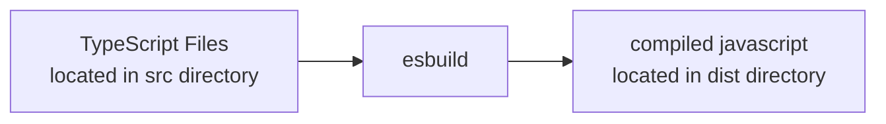
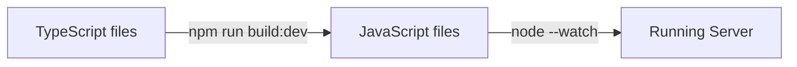

# 420-317-ah | Node Example

This project gives an idea of what a the express+deno hello world project
looks like in node js.


## Technical decision

As node.js does not run typescript natively, we need to compile the 
typescript code into javascript.  

We had multiple options for the bundler but we went for [esbuild](https://esbuild.github.io).
esbuild is fast, and relyable, moreover the project documentation is quite good.



## How to develop

All the source code is location in the `src` directory.  Each time the source code 
is modified, it needs to be re-compiled and re-executed.

### Compiling the source code (aka build)

Compiling the source code from typescript to javascript is quite easy.

```shell
npm run build
```

### Running the project

Before running the project, it is important to compile the source code.  Once this
is done, it is possible to run the program via npm or via node.

```shell
npm run build
```

```shell
node dist/main.js
```


### Developping the project

When developping the project, it is nice to be able to continuously compile
the typescript code into javascript. 

```shell
npm run build:dev
```

Then, one can use the the nodejs [`--watch`](https://nodejs.org/api/cli.html#--watch) parameter
to restart the webserver each time the javascript source changes.

```shell
node --watch dist/main.js
```

